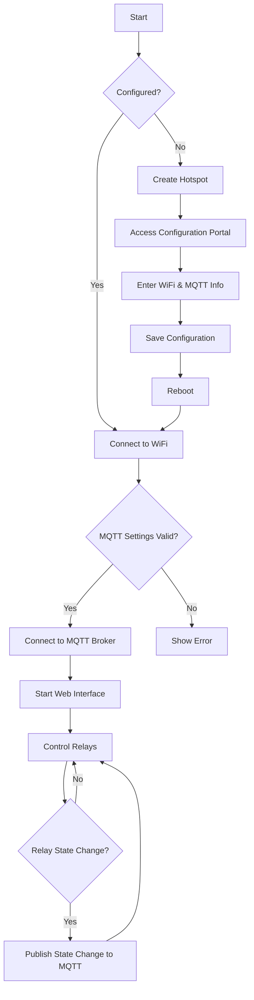

# Korir Relay

## Overview

The **Korir Relay** project is an IoT application designed for controlling multiple relays via MQTT, allowing users to manage connected devices remotely. Built on the ESP8266 microcontroller, this project features a web interface for configuration and control, providing an intuitive user experience.

## Features

- **WiFi and MQTT Configuration:** Easily set up and manage WiFi and MQTT settings through a user-friendly web interface.
- **Multiple Relay Control:** Supports up to four relays, enabling the control of various connected devices.
- **Auto-Discovery:** Automatically publishes relay configurations to Home Assistant, simplifying integration into smart home environments.
- **SPIFFS for Configuration Storage:** Utilizes SPIFFS to persistently store configuration settings, ensuring they are retained across power cycles.
- **Real-time Status Updates:** Sends updates on relay states via MQTT, allowing for immediate feedback and control.

## External Libraries

This project requires the following libraries:

- [ESP8266WiFi](https://github.com/esp8266/Arduino): Core WiFi functionality for ESP8266.
- [Ticker](https://github.com/matthijskooijman/arduino-ticker): Timer library for scheduling tasks.
- [ESPUI](https://github.com/Makuna/ESPUI): UI library for creating web interfaces on ESP devices.
- [FS](https://github.com/esp8266/Arduino): File system support for the ESP8266.
- [LittleFS](https://github.com/lorol/arduino-littlefs): A lightweight filesystem for ESP8266.
- [DNSServer](https://github.com/esp8266/Arduino): DNS server for handling requests.
- [MQTT](https://github.com/256dpi/arduino-mqtt): MQTT library for communication.
- [ArduinoJson](https://github.com/bblanchon/ArduinoJson): Library for handling JSON data.
- [PCF8574](https://github.com/xreef/PCF8574_library): I/O expander library for PCF8574.

## Hardware Requirements

- **Microcontroller:** ESP8266 (e.g., NodeMCU)
- **I/O Expander:** PCF8574
- **Relay Module:** Compatible relay module (typically 5V or 12V)
- **Push Buttons:** Optional for manual control
- **Breadboard and Jumper Wires:** For connections

## Setup Instructions

1. **Install Dependencies:**
   Ensure all required libraries are installed in your Arduino IDE. Use the Library Manager to install them.

2. **Connect Hardware:**
   - Connect the PCF8574 to the ESP8266:
     - SDA to GPIO4 (D2)
     - SCL to GPIO5 (D1)
   - Connect the relay module to the I/O expander:
     - Ensure that the relay module's control pins are connected to the corresponding pins on the PCF8574.
   - Optionally, connect push buttons to the PCF8574 for manual relay control.

3. **Upload the Code:**
   Load the provided code into your Arduino IDE and upload it to the ESP8266. Ensure you have selected the correct board and port.

4. **Configuration:**
   - If the device is not previously configured, it will create a hotspot for initial setup.
   - Connect to the hotspot and access the web interface at `http://192.168.4.1` to configure WiFi and MQTT settings.

5. **Connect to WiFi:**
   After entering your WiFi credentials and MQTT broker information, the ESP8266 will attempt to connect to the specified WiFi network.

6. **Home Assistant Integration:**
   The device automatically publishes the relay configurations to the MQTT broker, allowing for easy integration into Home Assistant or other smart home platforms.

## Usage

### Accessing the Web Interface

1. **Connect to the Device:**
   After configuration, the ESP8266 will connect to your WiFi network. You can access the web interface by entering the device's IP address in your browser. The IP address can be found in your router's connected devices list.

2. **Control Relays:**
   - In the web interface, you'll see options to turn each relay ON or OFF.
   - The interface will display the current state of each relay, allowing you to monitor their status in real-time.

3. **MQTT Control:**
   - You can also control the relays via MQTT commands.
   - Publish a message to the `home/<unique_id>/in` topic with the following JSON format:
     ```json
     {
       "light": <relay_number>,
       "state": "ON" or "OFF"
     }
     ```
   - For example, to turn on Relay 1, publish:
     ```json
     {
       "light": 1,
       "state": "ON"
     }
     ```

### Manual Control via Buttons

If you have connected push buttons:
- Pressing a button will toggle the corresponding relay's state. The current state will be updated both on the web interface and via MQTT.

### Monitoring Relay States

- The relay states are published to the `home/<unique_id>/out` topic in JSON format:
  ```json
  {
    "light1": "ON",
    "light2": "OFF",
    "light3": "ON",
    "light4": "OFF"
  }
  ```

## Flow Chart

Below is a flow chart representing the main processes in the Korir Relay project:



## Insights for Improvement

- **User Feedback:** Enhance the web interface with real-time feedback mechanisms (like alerts) when relays are activated or deactivated.
- **Security Enhancements:** Implement secure MQTT connections (SSL/TLS) to prevent unauthorized access to relay controls.
- **Mobile Compatibility:** Optimize the web interface for mobile devices to allow for easier control on the go.
- **User Authentication:** Add a user authentication system to the web interface for added security, allowing only authorized users to make changes.
- **Extended Relay Control:** Consider adding support for more than four relays or providing modular expansion options for users needing additional control.
- **Logging and Monitoring:** Implement a logging system to track relay usage over time, which can help in understanding usage patterns and troubleshooting.

By incorporating these insights, the Korir Relay project can evolve into a more robust and user-friendly IoT solution.